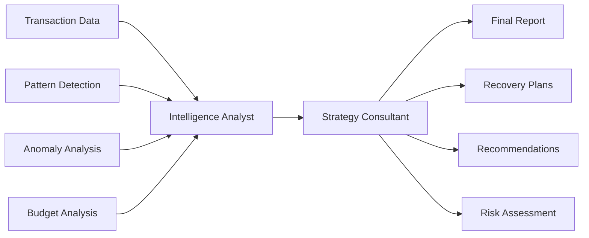

# 💰 Personal Finance Tracker & AI Report Generator

 tracker with AI-powered analysis and multi-format report generation. Built with Python, CrewAI, and Google's Gemini 2.0 Flash for intelligent financial insights.

---

## 1. Project Overview
This finance tracker combines traditional transaction logging with cutting-edge AI analysis to provide strategic financial insights. The system uses a **two-agent CrewAI architecture** powered by **Gemini 2.0 Flash** to analyze spending patterns, detect anomalies, and generate actionable financial recommendations.

### 🔥 Key Highlights
- **AI-Powered Analysis**: Strategic transaction intelligence using Gemini 2.0 Flash
- **Multi-Agent System**: Transaction Intelligence Analyst + Financial Strategy Consultant
- **Multi-Format Support**: `CSV`, `TXT`, `PDF`, and `MD` outputs with auto-synchronization
- **Budget Management**: Monthly/yearly budget tracking with AI-generated recovery strategies
- **Automated File Management**: Smart Downloads folder detection and cleanup operations 

---

## 2. Features

### 📊 Core Financial Tracking
- **7-Field Transaction Management**: `S.NO`, `DATE`, `DESCRIPTION`, `AMOUNT`, `PAYMENT METHOD`, `STATUS`, `NOTES`
- **Budget Analysis**: Compare spending against monthly/yearly budgets with overspend alerts
- **Multi-Format Exports**: Automatic `CSV`, `TXT`, `PDF`, and `MD` file generation
- **Real-Time Synchronization**: Auto-update all formats when transactions change
- **Data Validation**: Robust input validation with error handling

### 🤖 AI-Powered Analytics
- **Behavioral Segmentation**: Identify spending patterns (impulse vs planned purchases)
- **Liquidity Risk Analysis**: Calculate days of financial runway
- **Fraud Detection**: Network analysis for anomaly detection
- **Budget Recovery Plans**: AI-generated strategies for overspend scenarios
- **Trend Forecasting**: Year-end financial position projections 
- **Transaction Status Tracking**: Completion, pending, and failure analysis

### 🛠️ Advanced File Operations
- **Smart Downloads**: Cross-platform Downloads folder detection/creation
- **Bulk Repository Download**: Zip entire repo (excluding `__pycache__` and `README`)
- **Format Conversion Pipeline**: Seamless `CSV` ↔ `TXT` ↔ `PDF` ↔ `MD` conversion
- **Automatic Cleanup**: `__pycache__` and temporary zip file deletion
- **Timestamp Management**: Automatic file renaming with precise timestamps
- **File Integrity**: Flush and fsync operations for data safety

### 💡 User Experience
- **Terminal Interface**: Clean, intuitive command-line interaction
- **PrettyTable Visualization**: ASCII tables with proper alignment and formatting
- **Progress Feedback**: Real-time status updates during operations
- **Error Handling**: Comprehensive input validation and exception management
- **Session Management**: Graceful exit with cleanup operations

---

## 3. Project Structure
```
finance-tracker/
├── 📁 core/                                # Core application logic
│   ├── 🐍 budget_methods.py                # Budget management & comparison
│   └── 📄 default_budget.txt               # Default budget configuration
├── 📁 crewai_toolkits_gem_2point0_flash/      # AI toolkit modules
│   ├── 🐍 generate_report_from_csv.py         # Main AI report generator
│   └── 🐍 transform_csv_to_md_table.py        # CSV to ASCII table converter
├── 📁 file_methods/                        # File processing modules
│   ├── 🐍 csv_file_methods.py              # CSV operations & validation
│   ├── 🐍 md_file_methods.py               # Markdown file handling
│   ├── 🐍 pdf_file_methods.py              # PDF generation (FPDF)
│   └── 🐍 txt_file_methods.py              # Text file & PrettyTable ops
├── 📁 saved_files/                            # Generated files storage
│   ├── 📊 csv_*.csv                           # Transaction data files
│   ├── 📝 txt_version_of_csv_*.txt            # ASCII table versions
│   ├── 📄 pdf_*.pdf                           # PDF reports
│   ├── 📋 md_report_*.md                      # AI analysis reports
│   └── 📋 trial_csv_data                      # Test data template
├── 🎯 main_interface.py                    # 🎯 MAIN ENTRY POINT
├── 📥 download_to_device.py                # File download utilities
├── 📋 requirements.txt                     # Python dependencies
└── 📖 README.md                            # Project documentation
```

---

## 4. Installation & Setup

### Prerequisites
- **Python 3.8+** (Required for CrewAI and modern features)
- **Google Cloud Account** (for Gemini API access)
- **Terminal/Command Line** access

### 1. Clone Repository
```bash
git clone https://github.com/your-username/finance-tracker.git
cd finance-tracker
```

### 2. Install Dependencies
```bash
pip install -r requirements.txt
```

### 3. Set Up Google Gemini API
```bash
# Set your Google API key as environment variable
export GOOGLE_API_KEY='your_api_key_here'

# On Windows:
set GOOGLE_API_KEY=your_api_key_here

# On PowerShell:
$env:GOOGLE_API_KEY="your_api_key_here"
```
**Get your API key**: [Google AI Studio](https://ai.google.dev)

### 4. Initialize Default Budget
Edit `core/default_budget.txt`:
```
monthly = 6000, yearly = 72000
```

### 5. Set Up Test Data (Optional)
Copy the contents from `saved_files/trial_csv_data` into `saved_files/csv_*.csv` for testing:
```csv
S.NO,DATE,DESCRIPTION,AMOUNT,PAYMENT METHOD,STATUS,NOTES
01,28/06/2025,Groceries at SuperMart,45.75,Debit Card,Completed,Weekly shopping
02,28/06/2025,Bookstore purchase,32.99,Credit Card,Completed,Educational
...
```

### 6. Run the Application
```bash
python main_interface.py
```

---

## 5. Usage Guide

### Main Menu Options
```
1. Add Transaction(s)    - Input new financial transactions
2. View Spending         - Display transactions and budget status
3. Generate Report       - Create AI-powered financial analysis
4. Change Budget         - Modify monthly/yearly allocations
5. Download Files        - Export files to Downloads folder
6. Wipe Transactions     - Clear all transaction history
7. Exit                  - Clean up and terminate
``` 

### Transaction Fields

| Field | Description | Validation |
| :-- | :-- | :-- |
| **S.NO** | Sequential number (auto-generated) | Auto-increment |
| **DATE** | Transaction date | MM/DD/YYYY format |
| **DESCRIPTION** | Transaction description | <60 characters |
| **AMOUNT** | Transaction amount | Float (positive/negative) |
| **PAYMENT METHOD** | Payment type | Free text <20 chars |
| **STATUS** | Transaction status | Completed/Pending/Failed/Cancelled |
| **NOTES** | Additional notes | <60 characters |

### Report Generation

The AI system analyzes your data through two specialized agents:

**🧠 Agent 1: Transaction Data Conversion: CSV to ASCII Table**
- **PrettyTable Generation**: AI-powered conversion from CSV to terminal-ready ASCII tables
- **Two-Agent Quality Control**: Generator + Conformance checker for perfect formatting
- **Dynamic Width Calculation**: Auto-sizing columns based on content length
- **Terminal Optimization**: Clean ASCII output for command-line display

**📊 Agent 2: Financial Strategy Consultant** 
- **Executive Strategy Brief**: Summarizes the most important and actionable financial insights from the analysis.
- **Behavioral Segmentation Profiles**: Breaks down customer or user spending patterns into meaningful groups.
- **Liquidity Risk Dashboard**: Presents clear metrics and warnings about cash flow health and potential shortfalls.
- **Fraud Prevention Roadmap**: Outlines detected risks and practical steps to reduce fraud or suspicious activity.
- **Budget Recovery & Optimization**: Provides AI-generated strategies for managing overspending and improving future financial outcomes.
 
---

## 6. Dependencies & Technologies

### Core Dependencies

```txt
crewai          # Multi-agent AI framework
prettytable     # ASCII table formatting
fpdf            # PDF generation
pypdf           # PDF processing utilities
```

### Built-in Libraries Used

- `os`, `sys`, `csv` - File system operations
- `datetime`, `time` - Timestamp management
- `zipfile`, `shutil` - Archive and file operations
- `re`, `math` - Pattern matching and calculations

### AI & Machine Learning

- **Google Gemini 2.0 Flash** - Advanced language model
- **CrewAI Framework** - Multi-agent orchestration
- **LiteLLM Integration** - Model provider abstraction

---

## 7. AI Architecture

### Gemini 2.0 Flash Integration

This project leverages Google's latest **Gemini 2.0 Flash** model for:

- **Enhanced Performance**: 2x faster than Gemini 1.5 Pro
- **Multimodal Capabilities**: Text, image, and audio processing
- **Native Tool Calling**: Direct integration with Python functions
- **Advanced Reasoning**: Complex financial pattern analysis
- **Cost Efficiency**: Optimized for high-volume operations

### CrewAI Multi-Agent System



**Agent Configuration:**  
```python
llm = LLM(
    model="gemini/gemini-2.0-flash",
    temperature=0.5,
    api_key=GOOGLE_API_KEY
)
```

---

## 8. File Format Details

### CSV Structure
```csv
S.NO,DATE,DESCRIPTION,AMOUNT,PAYMENT METHOD,STATUS,NOTES
01,28/06/2025,Groceries at SuperMart,45.75,Credit Card,Completed,Weekly shopping
02,29/06/2025,Coffee at Starbucks,5.25,Cash,Completed,Morning coffee
```

### ASCII Table Output (PrettyTable)
```
+------+------------+----------------------+--------+----------------+-----------+------------------+
| S.NO |    DATE    |     DESCRIPTION      | AMOUNT | PAYMENT METHOD |  STATUS   |      NOTES       |
+------+------------+----------------------+--------+----------------+-----------+------------------+
|  01  | 28/06/2025 | Groceries at Super.. |  45.75 |  Credit Card   | Completed | Weekly shopping  |
|  02  | 29/06/2025 | Coffee at Starbucks  |   5.25 |      Cash      | Completed | Morning coffee   |
+------+------------+----------------------+--------+----------------+-----------+------------------+
```

### AI Report Structure (Markdown)
```markdown
# Financial Analysis Report

## Executive Summary
Key strategic insights and recommendations...

## Behavioral Segmentation Profiles
Customer spending patterns and habits...

## Liquidity Risk Dashboard
Financial health metrics and warnings...

## Fraud Network Mapping
Anomaly detection results and risk factors...

## Expense Optimization Plan
Cost reduction strategies and opportunities...

## Budget Recovery Roadmap
Overspend management with Plan A/B scenarios...

## Appendix
Full transaction table and supporting data...
```

---

## 9. Advanced Features

### Automatic File Management
- **Cross-Platform Downloads Detection**: Windows, macOS, Linux support
- **Timestamp Synchronization**: All files maintain consistent naming `format_DD_MM_YYYY_HH_MM_SS`
- **Format Conversion Pipeline**: 
  ```
  CSV → PrettyTable → TXT → PDF
                  ↓
                 AI Analysis → MD Report
  ```
- **Cleanup Operations**: 
  - Automatic `__pycache__` directory removal
  - Temporary zip file deletion
  - Session cleanup on exit

### Budget Analysis Engine
- **Real-Time Monitoring**: Instant budget threshold detection
- **Recovery Strategy Generation**: 
  - **Plan A**: Full deduction from next month's budget
  - **Plan B**: Proportional reduction across remaining months
- **Projection Models**: End-of-year financial forecasting
- **Category-Specific Analysis**: Spending breakdown by transaction type
- **Impact Assessment**: Overspend effects on annual savings goals

### File Download System
```bash
# Download specific files
python download_to_device.py filename.csv

# Download entire repository (flat structure)
python download_to_device.py all
```

**Features:**
- Automatic zip compression for non-CSV files
- Flat directory structure in Downloads folder
- Exclusion of system files (.git, __pycache__, README)
- Progress feedback and error handling

### Data Validation & Error Handling
- **Date Parsing**: Multiple format support (MM/DD/YYYY, MM-DD-YYYY, etc.)
- **Amount Validation**: Float parsing with negative value support
- **Status Validation**: Enum-based validation for transaction status
- **File Integrity**: `flush()` and `fsync()` operations for data safety
- **Retry Mechanisms**: Automatic retry for file operations

---

## 10. Troubleshooting

### Common Issues

**1. Google API Key Error**
```
ValueError: GOOGLE_API_KEY environment variable not set
```
**Solution**: Set your Google API key as environment variable
```bash
export GOOGLE_API_KEY='your_api_key_here'
```

**2. File Not Found Error**
```
FileNotFoundError: No such file or directory
```
**Solution**: Ensure you're running from the project root directory and `saved_files/` exists

**3. CrewAI JSON Parsing Error**
```
JSON parsing error: Expecting value: line 1 column 1 (char 0)
```
**Solution**: Check internet connection and API quota; restart application

**4. Permission Denied (Downloads)**
```
PermissionError: Access denied
```
**Solution**: Run with appropriate file system permissions or check Downloads folder accessibility

**5. PrettyTable Formatting Issues**
```
UnicodeEncodeError: 'ascii' codec can't encode
```
**Solution**: Ensure terminal supports UTF-8 encoding or use ASCII-only characters

### Performance Optimization Tips
- Keep CSV files under 1000 transactions for optimal AI processing
- Use SSD storage for faster file operations
- Close other applications during report generation
- Set terminal encoding to UTF-8 for proper table display

### Debug Mode
Enable verbose logging by modifying agent settings:
```python
verbose = True  # In generate_report_from_csv.py
```

---

## 11. Contributing

### Development Setup
1. Fork the repository
2. Create feature branch: `git checkout -b feature/amazing-feature`
3. Install development dependencies: `pip install -r requirements.txt`
4. Run tests with sample data from `trial_csv_data`
5. Commit changes: `git commit -m 'Add amazing feature'`
6. Push to branch: `git push origin feature/amazing-feature`
7. Open Pull Request

### Code Style Guidelines
- Follow PEP 8 guidelines for Python code
- Use descriptive variable names (`curr_csv_path` not `cp`)
- Add docstrings for complex functions
- Maintain modular architecture with clear separation
- Test with provided `trial_csv_data` before submitting

### Testing
Use the provided test data:
```bash
# Copy trial_csv_data contents to a new CSV file
cp saved_files/trial_csv_data saved_files/test_transactions.csv
python main_interface.py
```

---

## 12. Technical Resources

### Documentation Links
- [CrewAI Documentation](https://docs.crewai.com/)
- [Google Gemini API Guide](https://ai.google.dev/docs)
- [PrettyTable Documentation](https://pypi.org/project/prettytable/)
- [FPDF User Manual](https://pyfpdf.readthedocs.io/)

### Research Papers & Articles
- [Multi-Agent Systems in Finance](https://arxiv.org/abs/2301.07515)
- [LLM Applications in Financial Analysis](https://arxiv.org/abs/2310.12659)

### Example Implementations
- [Personal Finance Tracker Examples](https://github.com/Firdous2307/personal-finance-tracker)
- [CrewAI Multi-Agent Examples](https://github.com/DAEM007/finance-tracker-project)

--- 

## 13. License
This project is licensed under the MIT License - see the [LICENSE](LICENSE) file for details.

---

## 14. Quick Links
- **Google AI Studio**: [ai.google.dev](https://ai.google.dev)
- **CrewAI Framework**: [crewai.com](https://crewai.com)
- **Gemini 2.0 Flash**: [Google Blog](https://blog.google/technology/google-deepmind/google-gemini-ai-update-december-2024/)
- **Project Issues**: [GitHub Issues](https://github.com/your-username/finance-tracker/issues)

---

## 15. Quick Start Commands
```bash
# Clone and setup
git clone https://github.com/your-username/finance-tracker.git
cd finance-tracker
pip install -r requirements.txt

# Set API key
export GOOGLE_API_KEY='your_api_key_here'

# Run application
python main_interface.py

# Download all files
python download_to_device.py all
```

---

**Built with ❤️ using Python, AI, and lots of coffee ☕**

> *"Transforming personal finance through intelligent automation and strategic AI insights"*

**🌟 Star this repo if it helped you manage your finances better!**  
