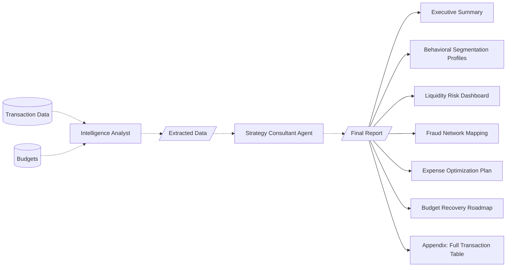

```mermaid
flowchart LR
    Aa[(Transaction Data)] -.-> Ab[Intelligence Analyst]
    Ac[(Budgets)] -.-> Ab 
    Ab -.-> A[/Extracted Data/]
    A -.-> Ba[Strategy Consultant Agent]
    Ba -.-> B[/Final Report/] 
    B --> C[Executive Summary]
    B --> D[Behavioral Segmentation Profiles]
    B --> E[Liquidity Risk Dashboard]
    B --> F[Fraud Network Mapping]
    B --> G[Expense Optimization Plan]
    B --> H[Budget Recovery Roadmap]
    B --> I[Appendix: Full Transaction Table] 
``` 
