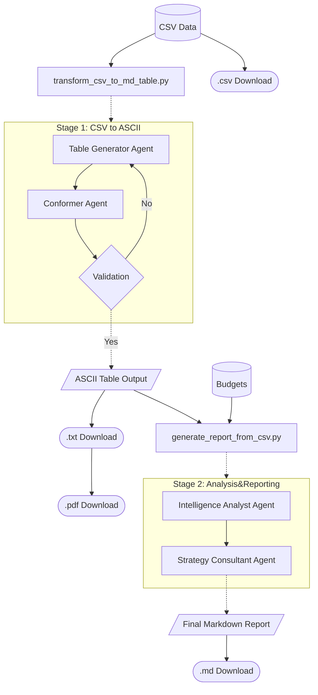

```mermaid
flowchart TD
    A[(CSV Data)] --> B[transform_csv_to_md_table.py]
    A --> Aa([".csv Download"])
    C --> Ca([".txt Download"])
    Ca --> Cb([".pdf Download"])
    C[/ASCII Table Output/] --> D[generate_report_from_csv.py]
    E[(Budgets)] --> D
    F[/Final Markdown Report/]
    F --> Fa([".md Download"])
 
    subgraph Stage1 ["Stage 1: CSV to ASCII"]
        B1[Table Generator Agent]
        B2[Conformer Agent]
        B1 --> B2
        B2 --> B3{Validation}
        B3 -->| No | B1 
    end

    subgraph Stage2 ["Stage 2: Analysis&Reporting"]
        D1[Intelligence Analyst Agent]
        D2[Strategy Consultant Agent]
        D1 --> D2
    end

    B -.-> Stage1
    D -.-> Stage2
    B3 -.->| Yes | C
    D2 -.-> F 
``` 
