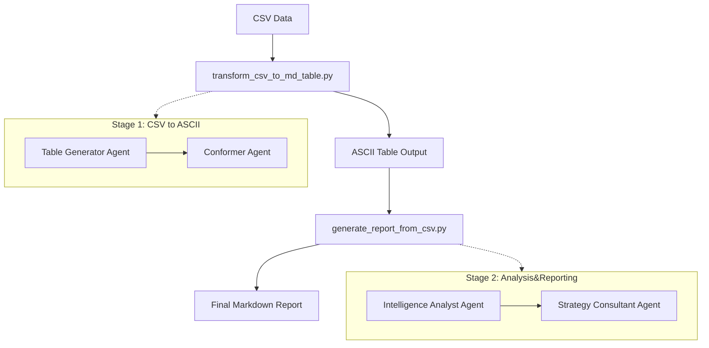

```mermaid
flowchart TD
    A[CSV Data] --> B[transform_csv_to_md_table.py]
    B --> C[ASCII Table Output]
    C --> D[generate_report_from_csv.py]
    D --> E[Final Markdown Report]

    subgraph Stage1 ["Stage 1: CSV to ASCII"]
        B1[Table Generator Agent]
        B2[Conformer Agent]
        B1 --> B2
    end

    subgraph Stage2 ["Stage 2: Analysis&Reporting"]
        D1[Intelligence Analyst Agent]
        D2[Strategy Consultant Agent]
        D1 --> D2
    end

    B -.-> Stage1
    D -.-> Stage2

```
